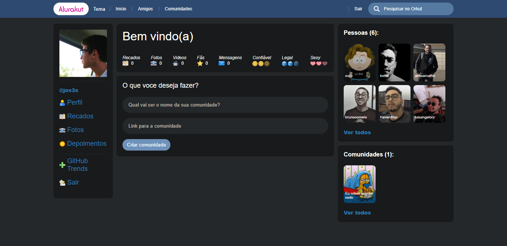

<h1 align="center">Alurakut 💬</h1>

<a href="https://alurakut.jos3s.dev">
  
</a>

<p align="center">
  Experimente o Alurakut uma versão moderna do antigo Orkut.
</p>

---

## 🧪 Tecnologias

O projeto utiliza as seguintes tecnologias:

- [Next.js](https://nextjs.org/)
- [React](https://reactjs.org)
- [Styled-components](https://styled-components.com/)
- [Styled-system](https://styled-system.com/)

## :bangbang: Pré-requisitos

- Node.js
- Yarn, NPM ou outro gerenciador de pacotes javascript

## :package: Instalação

Clone o repositório

```bash
git clone https://github.com/jos3s/ir03-alurakut.git

-- ou com github cli--

gh repo clone jos3s/ir03-alurakut
```

Entre na pasta

```bash
cd ir03-alurakut
```

Instale as dependências

```bash
yarn install 

-- ou --

npm install
```

E inicie a aplicação que vai rodar em localhost:3000

```bash
yarn dev 

-- ou --

npm dev
```

---  

<p align="center">
  Desenvolvido  por <a href="https://github.com/jos3s">José Ulisses</a> na 3 Imersão React da Alura.
</p>
